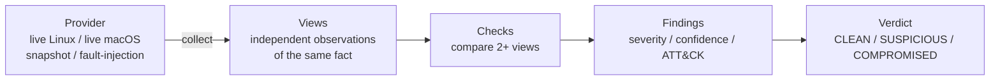

<p align="center">
  
</p>

<h3 align="center">Kernel-module rootkit detector for Linux and macOS</h3>

<p align="center">
  Plain C. No dependencies. No VM. Read-only.<br>
  It never trusts a single listing &mdash; it asks the kernel the same question several independent ways and reports when the answers disagree.
</p>

<p align="center">
  <a href="https://github.com/tejgokani/redoubt/actions/workflows/ci.yml"></a>
  <a href="LICENSE"></a>
  
  
  
  <a href="CONTRIBUTING.md"></a>
</p>

<p align="center">
  <b>English</b> &middot;
  <a href="docs/i18n/README.hi.md">हिन्दी</a> &middot;
  <a href="docs/i18n/README.es.md">Español</a> &middot;
  <a href="docs/i18n/README.fr.md">Français</a> &middot;
  <a href="docs/i18n/README.de.md">Deutsch</a> &middot;
  <a href="docs/i18n/README.pt-BR.md">Português (BR)</a> &middot;
  <a href="docs/i18n/README.zh-CN.md">简体中文</a> &middot;
  <a href="docs/i18n/README.ja.md">日本語</a> &middot;
  <a href="docs/i18n/README.ru.md">Русский</a>
</p>

<p align="center">
  <a href="#quick-start">Quick start</a> &middot;
  <a href="docs/DEMO.md">Demo script</a> &middot;
  <a href="#what-it-detects">What it detects</a> &middot;
  <a href="#evidence">Evidence</a> &middot;
  <a href="#limitations">Limitations</a> &middot;
  <a href="docs/">Docs</a>
</p>

---

## Table of contents

- [Overview](#overview)
- [Highlights](#highlights)
- [Quick start](#quick-start)
- [Installation](#installation)
- [Usage](#usage)
- [Example](#example)
- [What it detects](#what-it-detects)
- [How it works](#how-it-works)
- [Evidence](#evidence)
- [Limitations](#limitations)
- [Documentation](#documentation)
- [Roadmap](#roadmap)
- [Contributing, security and conduct](#contributing-security-and-conduct)
- [Citing](#citing)
- [License](#license)

## Overview

Loadable-kernel-module (LKM) rootkits on Linux, and their kernel-extension
counterparts on macOS, run with the same privilege as the operating system.
They rewrite what the kernel tells every other program &mdash; including
`lsmod`, `ps`, `netstat` and `ls`, the tools an administrator reaches for on a
machine they suspect.

Redoubt's answer is structural rather than a signature list. To hide, a rootkit
has to lie **consistently, through every path the kernel offers for asking the
same question**. The defender only needs one of those paths to tell the truth.
So Redoubt collects each fact through two or more paths a rootkit would have to
hook *separately* &mdash; a module via `/proc/modules`, its `/sys/module` node
and the kernel's executable-memory map; a process via the libc listing, the raw
`getdents64` syscall and a `kill(pid, 0)` probe; a port via `/proc/net/*` and
`bind()` &mdash; and reports the disagreements.

> **Read [docs/THREAT_MODEL.md](docs/THREAT_MODEL.md) before trusting a `CLEAN`
> verdict.** It states exactly what this approach can and cannot catch.

## Highlights

- **Cross-view detection, not signatures.** Behavioural checks that keep working when a rootkit is renamed.
- **16 checks** across module hiding, kernel-code integrity (syscall table, ftrace, inline hooks), hidden processes / ports / files, dynamic-linker injection, and macOS kernel extensions.
- **Calibrated findings.** Every finding carries a confidence (0&ndash;100), a MITRE ATT&CK id and a concrete next step. The verdict counts *independent checks*, not raw finding volume.
- **Race-aware.** Anything that can change mid-scan (processes, modules, sockets) is re-sampled and re-probed before it is reported, so a process that merely exits is not called a rootkit.
- **Honest coverage.** A check that could not run is reported as *skipped* with a reason. A `CLEAN` verdict says how many checks it covers.
- **Works offline.** `snapshot` saves every kernel view; `--from` analyses it later on any machine; `--baseline` diffs against a known-good state.
- **Zero dependencies.** C11, builds in seconds with `make`. Read-only: no daemon, no persistence, no automatic remediation.
- **Verified on a real kernel.** CI scans an unmodified Linux 6.17 kernel on every commit and fails unless it is `CLEAN` with full coverage.

## Quick start

```bash
git clone https://github.com/tejgokani/redoubt.git
cd redoubt
make                      # builds ./redoubt
make test                 # 88 unit assertions + the 10-scenario detection matrix

./redoubt demo            # replay bundled rootkit scenarios, offline, no root needed
sudo ./redoubt scan       # scan THIS machine (root gives full coverage on Linux)
```

No Linux machine handy? `./redoubt demo` and `make test` need neither root nor a
particular kernel, and the macOS collectors run natively.
[`docs/DEMO.md`](docs/DEMO.md) is a ready-to-run presentation script.

## Installation

Requirements: a C11 compiler (`cc`, `gcc` or `clang`) and `make`. Nothing else.

```bash
make
sudo make install         # /usr/local/bin/redoubt + /usr/local/share/redoubt/fixtures
```

`make install` honours `DESTDIR`. `make clean` removes build output.

**Platform status**

| Platform | Status |
|---|---|
| Linux x86_64 | All 13 applicable checks. A live scan of an unmodified Ubuntu kernel (6.17, Azure) runs in CI on every commit. |
| Linux, other architectures | Builds. The syscall-table check and most others are architecture-neutral; inline-hook decoding is x86_64 only. **Untested.** |
| macOS (Apple silicon) | All 5 applicable checks. Developed and tested on macOS 26 (Darwin 25.5). |
| macOS (Intel), other Unix | **Untested.** Snapshot analysis (`--from`) works anywhere the code builds. |

## Usage

```text
redoubt [command] [options]
```

| Command | What it does |
|---|---|
| `scan` | Scan this machine (the default command). |
| `demo [name\|all]` | Replay a bundled scenario through the real detection engine, offline. |
| `eval [dir]` | Run every scenario and print the pass/fail detection matrix. |
| `snapshot DIR` | Save every kernel view of this machine as an evidence bundle or baseline. |
| `list-checks` | List the 16 checks and what each one compares. |

| Option | Meaning |
|---|---|
| `--from DIR` | Analyse a snapshot or scenario directory instead of the live system. |
| `--baseline DIR` | Also compare against a known-good snapshot. |
| `--only a,b` / `--skip a,b` | Run or skip specific checks by id. |
| `--fail-on SEV` | Exit `1` on a detection at or above `info`, `low`, `medium`, `high` or `critical` (default `medium`). |
| `--strict-coverage` | Exit `3` if any check was skipped. |
| `--json` | Machine-readable report. |
| `--simulate SPEC` | Inject a rootkit-like lie into live data for demos (see [`docs/DEMO.md`](docs/DEMO.md)). |
| `--fast` | Limit the Linux pid brute-force range (quicker, slightly weaker). |
| `-v`, `--verbose` | Show not-applicable checks and hardening detail. |

**Exit status:** `0` nothing at or above `--fail-on` &middot; `1` detection &middot; `2` usage or internal error &middot; `3` incomplete coverage with `--strict-coverage`.

**Typical workflows**

```bash
sudo ./redoubt scan --json > report.json               # machine-readable report

sudo ./redoubt snapshot /var/tmp/evidence              # capture views from a suspect host
./redoubt scan --from /var/tmp/evidence                # analyse them later, on any machine

sudo ./redoubt snapshot /var/lib/redoubt/good          # record a known-good baseline once
sudo ./redoubt scan --baseline /var/lib/redoubt/good   # detect drift afterwards
```

## Example

```text
$ ./redoubt demo diamorphine-lkm

 SCENARIO diamorphine-lkm  Diamorphine-style LKM: syscall hooks + a module that erases itself everywhere
  ...
CHECKS
  [!!!!] mod-orphan-mem   Orphaned module memory                       1 finding
  [!!!!] mod-taint        Taint & kernel-log accounting                2 findings
  [!!!!] syscall-table    Syscall table integrity                      1 finding
  [!!!!] proc-xview       Hidden-process cross-view                    1 finding
  [!!!!] known-iocs       Known rootkit indicators                     1 finding

  1. [CRITICAL  96%] 3 syscall-table entries redirected outside kernel text
       #62 kill           -> 0xffffffffc0600120  unresolved kernel memory - no symbol
       #78 getdents       -> 0xffffffffc0600240  unresolved kernel memory - no symbol
       #217 getdents64    -> 0xffffffffc0600360  unresolved kernel memory - no symbol
  ...
 VERDICT  COMPROMISED   risk score 100/100   coverage 13/13 checks   5 independent checks flagging
```

The scenarios behind `demo` are **modelled** from each rootkit family's public
documentation &mdash; see [Evidence](#evidence) and [Limitations](#limitations) for
what that does and does not prove.

## What it detects

| Check | Cross-checks | Catches |
|---|---|---|
| `mod-xview` | `/proc/modules` &harr; `/sys/module` &harr; `kallsyms` | Modules hidden from `lsmod` but still in sysfs, or hidden by filtering the listing |
| `mod-orphan-mem` | executable-memory map &harr; `kallsyms` &harr; module sections | Memory of a module that removed itself from every kernel list |
| `mod-taint` | taint flags and kernel log &harr; module views | A module named in `dmesg` that no view lists |
| `mod-provenance` | loaded modules &harr; `modules.dep` | Modules loaded from outside the package-managed set |
| `syscall-table` | `sys_call_table` in `/proc/kcore` &harr; kernel text bounds | Syscall entries redirected into non-kernel memory |
| `ftrace-hooks` | `ftrace` callback owners &harr; visible modules | Hooks owned by hidden or unlisted code |
| `inline-hooks` | prologues of `getdents`, `filldir`, `tcp4_seq_show`, &hellip; | Inline `jmp` patches leaving kernel text |
| `proc-xview` | process listing &harr; raw syscall &harr; pid brute force | Hidden processes; tells kernel-level from user-space hiding |
| `net-xview` | `/proc/net/*` &harr; `bind()` on every port | Hidden listening ports |
| `fs-xview` | `readdir()` &harr; `st_nlink` and direct `stat()` | Hidden directories and known-bad paths |
| `preload` | `ld.so.preload`, `LD_PRELOAD`, `DYLD_INSERT_LIBRARIES` | Dynamic-linker hijacking |
| `known-iocs` | module names and install paths of public rootkits | Unmodified off-the-shelf toolkits (weakest signal, labelled as such) |
| `kext-inventory` | `kmutil` &harr; IOKit registry &harr; installed bundles | Unregistered or hidden macOS kernel extensions |
| `boot-integrity` | kernel boot-args | Code-signing / SIP tampering on macOS |
| `baseline` | current state &harr; a recorded snapshot | Drift from a known-good system |
| `hardening` | sysctl, lockdown, module signing, SIP | Posture advice &mdash; never affects the verdict |

## How it works



Checks are pure functions over data &mdash; they never call the OS directly. That is
what lets the same detection code run over a live scan, a saved snapshot, or a
replayed scenario. Details: [`docs/ARCHITECTURE.md`](docs/ARCHITECTURE.md).

## Evidence

Redoubt is tested on three different levels, and the documentation is explicit
about what each one proves:

- **A real Linux kernel, on every commit.** CI runs `sudo redoubt scan` on an
  unmodified Ubuntu 6.17 kernel and fails the build unless the verdict is `CLEAN`
  with all 13 applicable checks run. Getting there exposed three real
  false-positive bugs that hand-written test data could never have found; each
  is now a regression test, and a snapshot of that kernel is a permanent
  fixture (`fixtures/real-linux-6.17-azure`).
- **A real live hide on macOS.** `make hooks` builds a minimal user-space hook
  that hides a running process from `proc_listpids`; Redoubt catches it on the
  live machine. See [`docs/DEMO.md`](docs/DEMO.md).
- **Scenario matrix and unit tests.** `make test` runs 88 assertions and 10
  scenarios (6 modelled rootkit families, 4 clean/decoy controls) through the
  production engine. A dedicated test proves the decoy scenario is clean
  *because of* the anti-race logic, not by luck.

Full write-up, including what is *not* proven: [`docs/EVALUATION.md`](docs/EVALUATION.md).

## Limitations

Stated up front, because a false sense of security is worse than none:

- **It is an on-host, user-space tool.** A rootkit that lies consistently through
  every path Redoubt reads is invisible to it. Only an out-of-band view (a memory
  image from a hypervisor, or the disk read from another machine) can settle that.
- **The six rootkit scenarios are modelled** from public documentation, not captured
  from real infections. The real-kernel evidence shows the tool does not cry wolf;
  it does not show detection of a live hidden kernel module.
- **Root is needed for full Linux coverage.** Without it, checks are skipped and
  reported as skipped. Kernel lockdown can also restrict `/proc/kcore`.
- **Some checks are heuristics** and are confidence-capped accordingly (for example,
  a bound-but-never-listening socket looks like a hidden port).
- **Tested only** on Ubuntu (kernel 6.17, x86_64) and macOS 26 on Apple silicon.

Full discussion: [`docs/THREAT_MODEL.md`](docs/THREAT_MODEL.md).

## Documentation

| Document | Contents |
|---|---|
| [`docs/THREAT_MODEL.md`](docs/THREAT_MODEL.md) | What it targets, what `CLEAN` does and does not mean, non-goals |
| [`docs/ARCHITECTURE.md`](docs/ARCHITECTURE.md) | Views, providers, checks, data flow |
| [`docs/EVALUATION.md`](docs/EVALUATION.md) | Test evidence, the real bugs it found, the exact verdict rule |
| [`docs/DEMO.md`](docs/DEMO.md) | Step-by-step demonstration script |
| [`CONTRIBUTING.md`](CONTRIBUTING.md) | How to add a check |
| [`CHANGELOG.md`](CHANGELOG.md) | Release history |

Translations of this README live in [`docs/i18n/`](docs/i18n/). The English
README is authoritative; the technical documents are English only.

## Roadmap

Ideas, not commitments &mdash; contributions welcome:

- Inline-hook decoding and module-area handling for aarch64 Linux.
- SARIF output for code-scanning dashboards.
- More real captures (clean and, in a controlled lab, infected) as fixtures.
- Packaging: Homebrew formula, `.deb`, a man page.

## Contributing, security and conduct

- **Contributing:** see [`CONTRIBUTING.md`](CONTRIBUTING.md) &mdash; a check is a pure function over data, typically a few dozen lines plus a test.
- **Security issues:** please follow [`SECURITY.md`](SECURITY.md); do not open a public issue for a vulnerability.
- **Conduct:** this project follows the [Code of Conduct](CODE_OF_CONDUCT.md).

Redoubt is a **defensive** tool. It is read-only and never unloads a module, kills a
process or deletes a file. `tests/hooks/hide_pid.c` is a deliberately minimal
demonstration hook that hides a single process id from the program it is injected
into, provided for testing detection.

## Citing

If Redoubt helps your research or coursework, see [`CITATION.cff`](CITATION.cff) &mdash; GitHub
shows a "Cite this repository" button.

## License

[MIT](LICENSE) &copy; 2026 Tej Gokani
